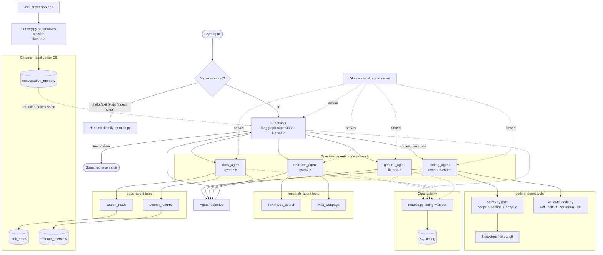

# Architecture Diagram

Full request-flow diagram for the personal local AI assistant. See
`REQUIREMENTS.md` for the fuller rationale behind each component.

Renders natively on GitHub (no extra tooling needed). Read top to
bottom: a query either short-circuits as a meta-command, or goes to the
supervisor, which routes to (and can chain) one or more of the four
specialist agents; each agent's tools are scoped to its own job;
`docs_agent`'s tools and cross-session memory both live in the same
local Chroma store, just different collections; every agent is
instrumented by the same timing wrapper regardless of which one ran.
