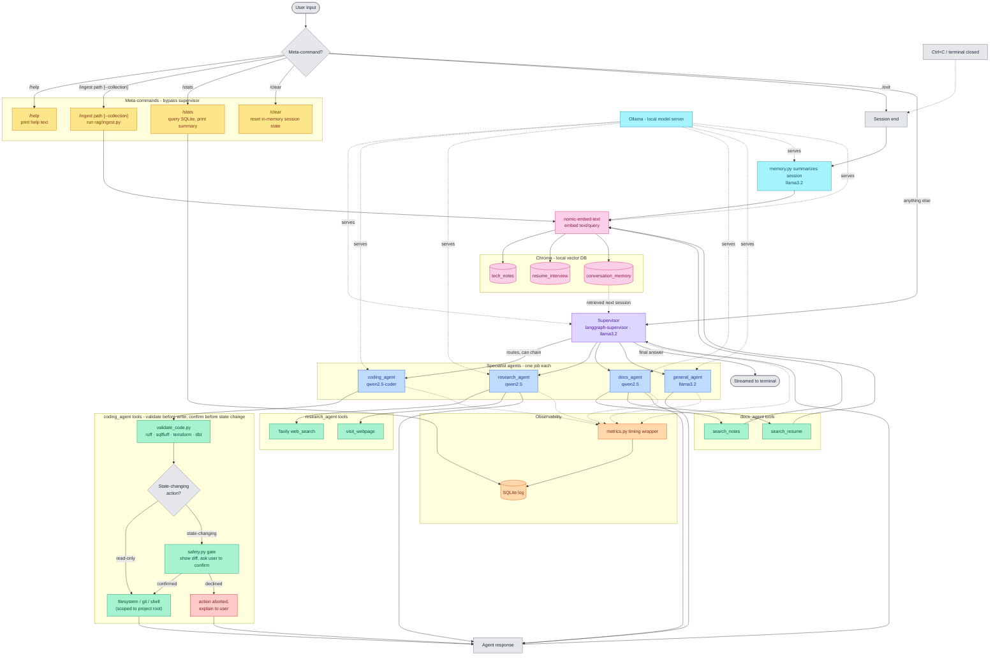

# Architecture Diagram

Full request-flow diagram for the personal local AI assistant. See
`REQUIREMENTS.md` for the fuller rationale behind each component.

**Color key**: **gray** = flow control/decision points, **amber** = meta-commands,
**violet** = orchestration (supervisor), **blue** = specialist agents,
**green** = tools/actions, **pink** = RAG/vector storage, **orange** =
observability, **cyan** = model serving, **red** = the one "stop/declined"
state. Renders natively on GitHub (no extra tooling needed).

**Reading it**: a query either short-circuits as a meta-command or goes
to the supervisor, which routes to (and can chain) one or more of the
four specialist agents; each agent's tools are scoped to its own job.
`coding_agent` **validates generated code before deciding whether it
even needs confirmation** — read-only actions proceed straight through,
state-changing ones stop for explicit user approval, and a decline
aborts cleanly rather than silently doing nothing. Every RAG operation
(ingest, both search tools, session-summary storage) passes through the
same embedding step before touching Chroma — there's no direct
tool-to-vector-DB edge anywhere. Every agent is instrumented by the same
timing wrapper regardless of which one ran; meta-commands each have a
real destination rather than one generic handler.
