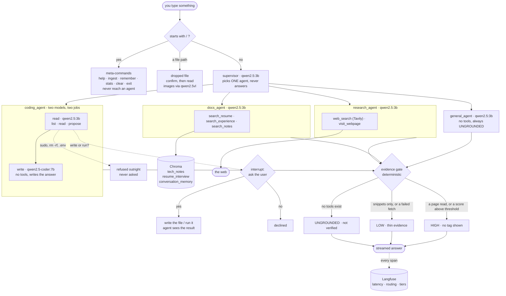

# myassistant

A personal, local-first AI assistant. Four specialist agents behind a router,
running entirely on your own machine through [Ollama](https://ollama.com) — no
API keys for the models, and nothing about your documents leaves the laptop.

Built to learn agentic AI patterns properly: LangGraph orchestration, RAG over
your own files, tool safety boundaries, and observability wired in from the
first commit rather than bolted on.

```
you ask something
   ↓
supervisor  (qwen2.5:3b)   picks one agent, never answers itself
   │
   ├─→ coding_agent     reads the project you launched from; writes code
   ├─→ docs_agent       your CV, notes, interview prep
   ├─→ research_agent   the web — searches and reads pages
   └─→ general_agent    quick chat and drafts, no tools
   ↓
the answer, streamed, with an evidence-based confidence tag
```

**The idea it's built around:** an answer should say how well grounded it is,
and that signal should come from *what actually happened* — did the page fetch
return real content, did retrieval clear a relevance threshold — never from
asking the model how sure it feels.

---

## Setup

**Requires:** macOS or Linux, Python 3.12+, [uv](https://docs.astral.sh/uv/),
Ollama, and Docker (for Langfuse — optional).

```bash
# 1. models (~5.4 GB)
ollama pull qwen2.5:3b-instruct              # supervisor, research, docs, general
ollama pull qwen2.5-coder:7b-instruct-q4_K_M # writing code
ollama pull nomic-embed-text                 # RAG embeddings
ollama pull qwen2.5vl:3b                     # reading images (optional)

# 2. dependencies
uv sync

# 3. secrets
cp .env.example .env      # then fill in the values below

# 4. tracing (optional, but /stats needs it)
docker compose -f docker-compose.langfuse.yml up -d
#    open http://localhost:3000, sign up, create a project,
#    then Settings → API Keys → copy them into .env

# 5. install it on your PATH
uv tool install . --force
```

### What goes in `.env`

| Key | Needed for | Where from |
|---|---|---|
| `TAVILY_API_KEY` | web search | [tavily.com](https://tavily.com) — free tier |
| `LANGFUSE_PUBLIC_KEY` / `LANGFUSE_SECRET_KEY` | tracing and `/stats` | the Langfuse UI at localhost:3000 |
| `CAREER_ROLES` | cross-role questions about your work | you — see below |

Everything is optional. Without Tavily, web search says so instead of failing;
without Langfuse, tracing is skipped and the assistant runs normally.

`CAREER_ROLES` lists your jobs, most important first, so "walk me through my
career" can search each one and miss none:

```
CAREER_ROLES=Capital One:capitalone, Michelin:michelin, Ironhack:ironhack
```

The label is what you see; the fragment after the colon is matched against
document paths. It lives in `.env` rather than the repo because it's personal.

---

## Using it

```bash
myassistant          # from any directory
```

The directory you launch from becomes the project `coding_agent` can read —
so `cd` into a repo first if you want to ask about its code.

### Load your documents

```
/ingest ~/Documents/notes                    → tech_notes (default)
/ingest ~/Documents/application_docs resume  → resume_interview
```

Re-run it any time. Unchanged files cost nothing, and changed ones replace
their own chunks rather than piling up beside the old version. Reads `.md`,
`.pdf`, `.docx`, `.txt`; skips backups, credential-looking files, and anything
inside a nested git repo.

### Ask things

| You type | Where it goes |
|---|---|
| `what did I do at Capital One?` | `docs_agent` → your documents |
| `walk me through my career` | `docs_agent` → searches every role |
| `write a SQL query for the 2nd highest salary` | `coding_agent` → the coder model |
| `what does run_turn do in main.py?` | `coding_agent` → reads the file |
| `create fizzbuzz.py` | `coding_agent` → **asks before writing** |
| `what changed in Airflow 3.0?` | `research_agent` → web |
| `draft a thank-you note` | `general_agent` |

### Drag a file onto the terminal

Drop a screenshot, a PDF or a diagram on the window and press enter. It asks
permission, then reads it — images through a vision model. The content joins
the conversation but isn't stored, which is the difference from `/ingest`.

### Commands

| | |
|---|---|
| `/help` | list commands |
| `/ingest <path> [notes\|resume]` | add documents |
| `/remember <text>` | keep a note for future sessions |
| `/stats [all\|24h\|3d]` | latency, routing and confidence |
| `/clear` | forget this conversation, keep the session |
| `/exit` | quit — summarises the session into memory |

### Reading the confidence tag

```
[thin evidence - the sources did not really cover this]
[general knowledge, not verified against any source]
```

No tag means well grounded — a page was really read, or retrieval cleared its
threshold. A tag means treat it as a starting point. Nothing here is a model's
opinion of itself; every tier comes from something that measurably happened.

---

## Architecture



**Three things worth noticing.**

`coding_agent` runs **two models**: a 3B that calls tools, because the coder
model emits tool calls as plain text and never actually invokes them, and the
coder model for writing, where no tools are bound and the defect is irrelevant.

The **evidence gate is deterministic** — it reads what the tools reported, never
what the model claims. A confident answer built on a failed fetch is still LOW.

Writes **pause the graph mid-tool** and ask, then resume on the same line — so
the agent sees whether the write succeeded within the same turn. Refusals never
become questions: the denylist can't be overridden by saying yes.

---

## What it remembers

| | Where | Survives restart |
|---|---|---|
| Ingested documents | `~/.myassistant/chroma` | yes |
| Session summaries and `/remember` notes | same, separate collection | yes |
| The current conversation | in memory | no |

All under `~/.myassistant/`, never the directory you launched from — so your
knowledge base doesn't fragment across projects.

---

## Safety

`coding_agent` is the only agent that can change anything, and it's fenced:

- **Nothing outside the launch directory.** Paths are resolved before they're
  checked, so `../../.ssh/id_rsa` and symlinks out are both caught.
- **Credential files are refused** — reads as well as writes. Quoting a secret
  into a model's context is its own leak.
- **Writes and state-changing commands pause and ask.** Read-only commands run
  immediately; friction only where it matters.
- **Some things are never allowed**, confirmation or not: `sudo`, recursive
  deletes, piping a download into a shell. A confirmation is not a safety
  boundary — people say yes to prompts.

---

## Known limits

- **~13s for a typical turn**, and a coding question that reads a file can take
  a minute or more. Run `/stats` for real numbers.
- **3B models are small.** Routing is right roughly 13 times in 14, and the
  supervisor occasionally answers nothing — ask again, naming a file or "my
  notes".
- **It can be confidently wrong on detail** even when grounding worked, because
  the tier certifies the *evidence*, not every sentence built on it.
- **`.pages` and HEIC files can't be read.** Export to PDF or JPEG.

---

## Development

```bash
uv run pytest tests/ -q             # 340 tests, ~6s, no live services
uv run pytest tests/ -m live        # opt-in smoke tests against real services
uv run pre-commit run --all-files   # 9 hooks including gitleaks and mypy
```

`project_docs/` holds the reasoning: `PROJECT_REQUIREMENTS.md` is the spec,
`DESIGN_DECISIONS.md` records what changed and why — including several
conclusions that turned out to be wrong, and how they were found.
