# Architecture Diagram

The request flow **as built**, updated after steps 0-10. `PROJECT_REQUIREMENTS.md`
carries the rationale; `DESIGN_DECISIONS.md` records what changed from the
original plan and why. The README has a shorter version of this diagram for
people who just want to use the thing.

Where this differs from the first draft — and it differs a lot — the
differences are the interesting part. They are listed at the bottom.

## The generated diagrams

Two renderings of the detail — every tool, threshold, constant and refusal
path. Both are generated, so neither can drift from the code the way a drawn
picture does.

| File | From | What it is for |
|---|---|---|
| `architecture.drawio` | `make_drawio.py` | editable; committed, since it is XML |
| `architecture_layout.png` | `make_drawio.py` | a preview of the above, gitignored |
| `architecture.png` | `make_diagram.py` | one static 8000px picture, gitignored |

The `.drawio` is the one to reach for. It opens in draw.io and imports into
Lucidchart, and being text it diffs — 61 boxes, 62 labelled edges, 13 panels.

**Why a second renderer rather than one diagram.** `make_diagram.py` goes
through graphviz via the `diagrams` library, which draws a node as an *icon*
with its caption rendered **outside** the box. Graphviz reserves space for the
icon and knows nothing about the text hanging under it, so a four-line caption
is zero pixels wide as far as the layout engine is concerned — every overlap in
that PNG traces back to this, and none of it is fixable except by nudging
margins until it happens to look right.

`make_drawio.py` puts the text inside the box and sets the width itself, then
places boxes in explicit bands. Because the geometry is known rather than
solved, it can be *checked* — and everything below fails the build rather than
being left to the eye:

| Check | What it rules out |
|---|---|
| `assert_no_overlap` | two boxes touching |
| `assert_clusters_clean` | panels overlapping without nesting |
| `assert_every_edge_labelled` | an arrow the reader has to guess at |
| `assert_routes_clear` | a line crossing a box or panel it does not belong to |

Routing is the part that earned the most work. A line that disappears behind a
box takes its arrowhead with it and reads as a *missing* arrow, so routes leave
and enter at box edges, keep 16px clear of anything they pass, and treat a
cluster panel as solid unless one of their own endpoints lives in it. The
simple three-leg router handles 37 of the 62; the remaining 25 go to A* over a
visibility grid. Afterwards `separate()` pulls apart any two runs that ended up
along the same line, and only ever moves interior segments — the ends are
attached to a box.

Labels follow the same rules as the lines: clear of boxes, panels, other
labels, and other edges' lines, placed at the arrow they describe rather than
always above the target.

Below is the same architecture as text: it renders on GitHub without graphviz,
and it diffs.

```mermaid
flowchart TD
    User(["User input"]) --> MetaCheck{"What is this line?"}

    subgraph MetaCommands ["Meta-commands - never reach an agent"]
        Help["/help"]
        Ingest["/ingest path [notes|resume]<br/>rag/ingest.py"]
        Stats["/stats [all|24h|3d]<br/>observability/stats.py"]
        Clear["/clear"]
        Remember["/remember text<br/>stored verbatim"]
    end

    MetaCheck -->|"/help"| Help
    MetaCheck -->|"/ingest"| Ingest
    MetaCheck -->|"/stats"| Stats
    MetaCheck -->|"/clear"| Clear
    MetaCheck -->|"/remember"| Remember
    MetaCheck -->|"/exit"| SessionEnd

    subgraph Dropped ["Dragged file - dropped.py"]
        DropCheck{"denied name?<br/>.env, *.pem, ~/.ssh"}
        DropAsk{"confirm:<br/>show path and size"}
        DropImage["read_image.py<br/>downscale to 1600px<br/>qwen2.5vl:3b"]
        DropText["ingest loaders<br/>md · pdf · docx · txt"]
        DropRefused["refused"]
    end
    MetaCheck -->|"an existing file path"| DropCheck
    DropCheck -->|"yes"| DropRefused
    DropCheck -->|"no"| DropAsk
    DropAsk -->|"image"| DropImage
    DropAsk -->|"text"| DropText

    MetaCheck -->|"a question"| Supervisor["Supervisor<br/>langgraph-supervisor · qwen2.5:3b<br/>routes only, never answers"]

    subgraph Agents ["Specialist agents - one job each, each ending in a gate"]
        direction TB
        Coding["coding_agent<br/>read: qwen2.5:3b<br/>write: qwen2.5-coder:7b"]
        Docs["docs_agent<br/>qwen2.5:3b"]
        Research["research_agent<br/>qwen2.5:3b"]
        General["general_agent<br/>qwen2.5:3b · no tools"]
    end

    Supervisor --> Coding
    Supervisor --> Docs
    Supervisor --> Research
    Supervisor --> General

    subgraph CodingTools ["coding_agent tools - every path through safety.py"]
        ReadOnly["list_project_files<br/>read_project_file"]
        Verdict{"safety.check_command<br/>ALLOW · CONFIRM · DENY"}
        Interrupt{"interrupt()<br/>pauses the graph,<br/>asks the REPL"}
        Act["write the file<br/>run the command"]
        Declined["declined - the agent<br/>sees that it was"]
        Denied["refused outright<br/>never asked"]
    end
    Coding --> ReadOnly
    Coding --> Verdict
    Verdict -->|"ALLOW (read-only)"| Act
    Verdict -->|"CONFIRM"| Interrupt
    Verdict -->|"DENY: sudo, rm -rf, .env"| Denied
    Interrupt -->|"yes"| Act
    Interrupt -->|"no"| Declined
    Act -.->|"resumes in the tool"| Coding

    subgraph ResearchTools ["research_agent tools"]
        Tavily["web_search · Tavily<br/>snippets only, never enough alone"]
        Visit["visit_webpage<br/>looks_empty() catches redirect shells"]
    end
    Research --> Tavily
    Research --> Visit
    Visit --> Web(["the web"])
    Tavily --> Web

    subgraph DocsTools ["docs_agent tools - one per collection"]
        SearchNotes["search_notes"]
        SearchResume["search_resume"]
        SearchExp["search_experience<br/>one query per career role"]
    end
    Docs --> SearchNotes
    Docs --> SearchResume
    Docs --> SearchExp

    Embedding["nomic-embed-text"]
    Ingest --> Manifest[("manifest.db<br/>source to content hash<br/>unchanged files cost nothing")]
    Manifest --> Embedding
    SearchNotes --> Embedding
    SearchResume --> Embedding
    SearchExp --> Embedding
    Summarize --> Embedding
    Remember --> Embedding

    subgraph VectorDB ["Chroma - embedded, no server"]
        TechNotes[("tech_notes")]
        ResumeCol[("resume_interview<br/>chunks tagged by career role")]
        MemCol[("conversation_memory")]
    end
    Embedding --> TechNotes
    Embedding --> ResumeCol
    Embedding --> MemCol

    subgraph Gate ["Evidence gate - deterministic, no model call"]
        GateCheck{"any ok Observation<br/>that is not just a search?"}
    end
    Coding --> GateCheck
    Docs --> GateCheck
    Research --> GateCheck
    General --> GateCheck
    GateCheck -->|"a page read, or a RAG score above threshold"| High["HIGH<br/>no tag shown"]
    GateCheck -->|"snippets only, or a failed fetch"| Low["LOW<br/>thin evidence"]
    GateCheck -->|"no tools exist to check with"| Ungrounded["UNGROUNDED<br/>not verified"]

    High --> Stream(["Streamed to the terminal, token by token"])
    Low --> Stream
    Ungrounded --> Stream
    DropImage --> Stream
    DropText --> Stream

    ProcessExit["Ctrl-D / /exit"] -.-> SessionEnd
    SessionEnd["Session end"] --> Summarize["rag/memory.py<br/>summarises the session<br/>qwen2.5:3b"]
    MemCol -.->|"recalled once, next session"| Supervisor

    subgraph Obs ["Observability - self-hosted Langfuse, optional"]
        Langfuse["CallbackHandler<br/>latency, tokens, tool I/O"]
        LangfuseDash[("dashboard + API")]
    end
    Supervisor -.-> Langfuse
    Coding -.-> Langfuse
    Research -.-> Langfuse
    Docs -.-> Langfuse
    General -.-> Langfuse
    GateCheck -.->|"confidence score"| Langfuse
    Langfuse --> LangfuseDash
    Stats -.->|"queries, scoped to session or window"| LangfuseDash

    Ollama["Ollama - local model server"]
    Ollama -.-> Supervisor
    Ollama -.-> Coding
    Ollama -.-> Research
    Ollama -.-> Docs
    Ollama -.-> General
    Ollama -.-> Summarize
    Ollama -.-> Embedding
    Ollama -.-> DropImage

    classDef flow fill:#e5e7eb,stroke:#6b7280,color:#1f2937
    classDef meta fill:#fde68a,stroke:#d97706,color:#78350f
    classDef orchestration fill:#ddd6fe,stroke:#7c3aed,color:#4c1d95
    classDef agent fill:#bfdbfe,stroke:#2563eb,color:#1e3a8a
    classDef tool fill:#a7f3d0,stroke:#059669,color:#064e3b
    classDef storage fill:#fbcfe8,stroke:#db2777,color:#831843
    classDef obs fill:#fed7aa,stroke:#ea580c,color:#7c2d12
    classDef serving fill:#a5f3fc,stroke:#0891b2,color:#164e63
    classDef stop fill:#fecaca,stroke:#dc2626,color:#7f1d1d
    classDef tier fill:#e9d5ff,stroke:#9333ea,color:#581c87

    class User,MetaCheck,Stream,SessionEnd,ProcessExit,Verdict,Interrupt,DropCheck,DropAsk,GateCheck flow
    class Help,Ingest,Stats,Clear,Remember meta
    class Supervisor orchestration
    class Coding,Research,Docs,General agent
    class ReadOnly,Act,Tavily,Visit,SearchNotes,SearchResume,SearchExp,DropImage,DropText tool
    class Embedding,TechNotes,ResumeCol,MemCol,Manifest storage
    class Langfuse,LangfuseDash obs
    class Ollama,Summarize serving
    class Denied,Declined,DropRefused stop
    class High,Low,Ungrounded tier
```

**Colour key**: gray = flow and decisions, amber = meta-commands, violet =
orchestration, blue = agents, green = tools, pink = storage, orange =
observability, cyan = model serving, purple = confidence tiers, red = refused
or declined. Renders natively on GitHub.

## Reading it

A line is one of three things: a meta-command, a dragged file path, or a
question. Only the third reaches the supervisor, which picks exactly one agent
and never answers itself.

**Every agent ends at the same gate**, and the gate is deterministic — it reads
what the tools reported, never what the model claims. That is why a confident
answer built on a failed fetch still comes out LOW.

**Every write goes through `safety.py` first**, and the three verdicts are not
three flavours of the same thing: ALLOW runs immediately, CONFIRM pauses the
graph with `interrupt()` and asks, and DENY never becomes a question at all —
because a confirmation is not a safety boundary.

**Every RAG operation passes through the same embedding step.** There is no
direct tool-to-Chroma edge, and `/ingest` goes through the manifest first so
unchanged files cost nothing.

## What changed from the original design

The first version of this diagram was drawn before any of it was built. Nearly
every model choice in it turned out to be wrong, and each was corrected by
measurement rather than argument — the details are in `DESIGN_DECISIONS.md`.

| Originally | Now | Why |
|---|---|---|
| supervisor on `llama3.2` | `qwen2.5:3b` | routed 6/8 vs 8/8 on the same questions |
| `coding_agent` on `qwen2.5-coder` | two models: 3B reads, coder writes | the coder model emits tool calls as plain text, so it can never call anything |
| `validate_code.py` before every write | not built | the confirmation gate came first; validation is still open |
| confirmation as a plain prompt | `interrupt()` pausing the graph | so the agent sees whether the write succeeded, in the same turn |
| no evidence gate | a gate on every agent | the original had no validation at all for three of the four agents |
| `/ingest` appends | manifest plus delete-before-add | otherwise a re-ingest leaves stale chunks competing with current ones |
| two RAG collections searched by one tool | three collections, one tool each | a 3B picks between named tools far more reliably than it fills in an argument |
| no dragged files, no images | `dropped.py` and `read_image.py` | added after the fact; the vision model was chosen by testing three |
